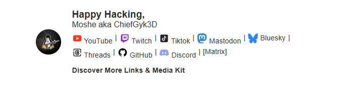

# Responsive Email Signature Template

A responsive email signature template in HTML designed for personal branding. It features icons and links to popular social media platforms, organized to remain in a single row until it requires wrapping on smaller screens. This template is easy to customize, and responsive elements ensure it displays well across devices and email clients.



## Table of Contents
- [Installation](#installation)
- [Usage](#usage)
- [Customization](#customization)
- [Adding New Social Links](#adding-new-social-links)
- [License](#license)

---

## Installation

1. Clone this repository or download the HTML file directly:
   ```bash
   git clone https://github.com/ChiefGyk3D/email_signature.git
   ```

2. Open the HTML file in any code editor.

---

## Usage

1. **Copy the HTML**:
   - Select and copy all code in the HTML file.

2. **Paste into Email Client**:
   - Go to your email client’s settings to edit your signature.
   - Paste the HTML code into the email signature editor.
   - Save the changes.

> **Note**: Some email clients may restrict certain HTML or CSS features. Test your signature to ensure it appears as expected.

---

## Customization

To make this template yours, replace the placeholder links and profile image with your own:

- **Profile Image**:
  - Replace the `src` URL in the profile image `` tag:
    ```html
    
    ```

- **Personal Text**:
  - Customize the greeting and your name in the signature text section:
    ```html
    <p style="margin: 0; font-size: 1.2em; color: #2d2d2d;"><strong>Your Greeting Here,</strong></p>
    <p style="margin: 0; font-size: 1em;">Your Name Here</p>
    ```

- **Social Links**:
  - Update each `<a>` tag’s `href` attribute to point to your own profiles. For example:
    ```html
    <a href="https://youtube.com/yourprofile" style="text-decoration: none; color: #333;">
       YouTube
    </a>
    ```

---

## Adding New Social Links

To add a new social link, follow these steps:

1. **Locate an icon**:
   - Find a 20x20px icon for the new social platform (free sources like [Icons8](https://icons8.com) work well).

2. **Add HTML**:
   - Insert a new `<a>` tag following the format of existing links, adding your new icon and link URL:
     ```html
     <a href="https://new-platform.com/yourprofile" style="text-decoration: none; color: #333;">
        Platform Name
     </a>
     ```

3. **Spacing and Responsiveness**:
   - Your link will adapt with the other icons to maintain a single row on larger screens and wrap as needed on smaller screens.

---

## License

This project is licensed under the MIT License – see the [LICENSE](LICENSE) file for details.

---

### Contributing

Feel free to fork this repository and submit pull requests to add features, improve compatibility, or include additional customization options.

Happy branding!
